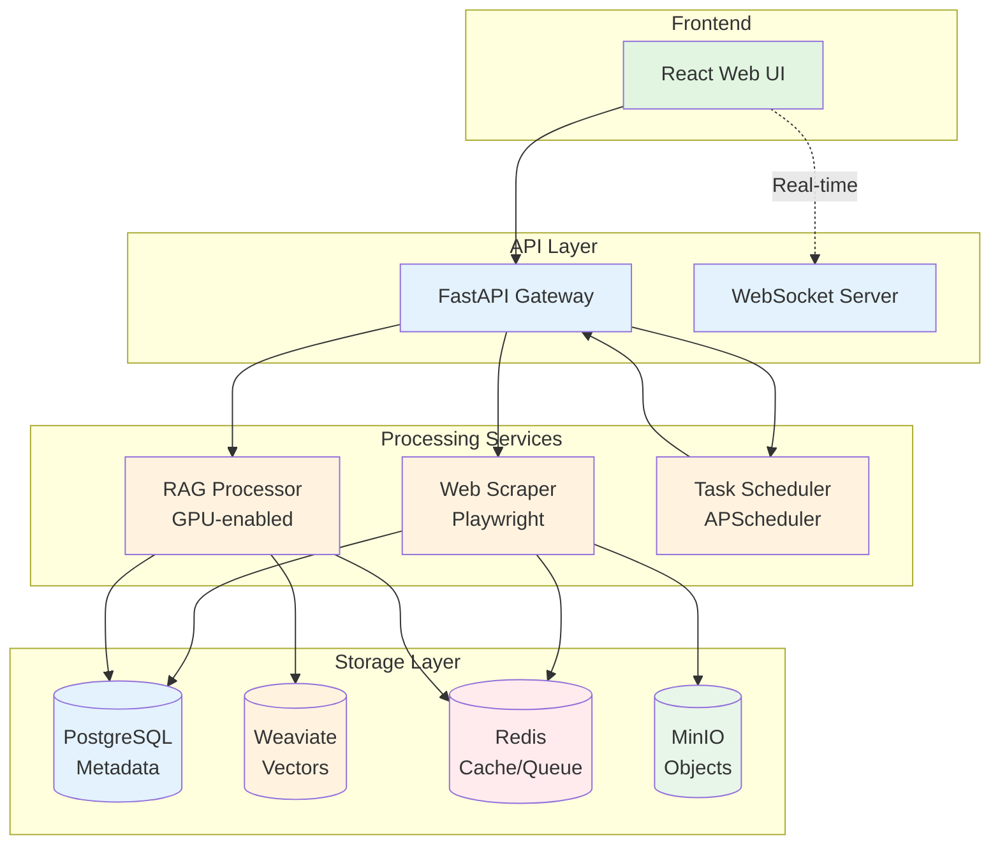

# KnowledgeHub

<div align="center">


[](LICENSE)
[](https://www.python.org/downloads/)
[](https://www.typescriptlang.org/)
[](https://www.docker.com/)
[](https://fastapi.tiangolo.com/)
[](https://reactjs.org/)

**An intelligent, production-ready knowledge management system powered by AI**

[🚀 Quick Start](docs/QUICK_START.md) • [📖 User Guide](docs/USER_GUIDE.md) • [👨‍💼 Admin Guide](docs/ADMIN_GUIDE.md) • [🏗️ Architecture](docs/ARCHITECTURE.md) • [⚙️ Deployment](docs/DEPLOYMENT_PIPELINE.md)

</div>

---

## 📢 Recent Updates

### v1.1.0 - Real-time Dashboard Updates (2025-07-04)
- **🔄 Live Stats Updates**: Dashboard statistics now update in real-time via WebSocket
- **🚀 Auto-refresh**: Dashboard refreshes every 30 seconds automatically
- **🔔 WebSocket Notifications**: Job completions trigger immediate UI updates
- **🎯 Cache Invalidation**: Improved query cache management for instant updates
- **📊 Manual Refresh**: Added refresh button for on-demand stats updates

See [Dashboard Stats Update Documentation](docs/DASHBOARD_STATS_UPDATE_FIX.md) for implementation details.

### v1.1.1 - Jobs Page Auto-refresh (2025-07-04)
- **⚡ Jobs Auto-refresh**: Jobs page updates every 5 seconds automatically
- **🔄 Manual Sync**: Added sync button for immediate job list refresh
- **📱 Background Updates**: Continues refreshing when tab is not active
- **🎯 Real-time Status**: Job status changes appear within seconds

See [Jobs Page Auto-refresh Documentation](docs/JOBS_PAGE_AUTO_REFRESH_FIX.md) for implementation details.

### v1.1.2 - Scheduler AttributeError Fix (2025-07-04)
- **🛠️ Fixed Scheduler Error**: Resolved AttributeError for 'next_run_time' in APScheduler
- **✅ Proper Attribute Checking**: Added hasattr() validation before accessing job attributes
- **📅 Weekly Refresh**: Scheduler now runs reliably every Sunday at 2 AM UTC
- **🔍 Improved Logging**: Better error handling and status messages

See [Scheduler Fix Documentation](docs/SCHEDULER_ATTRIBUTE_ERROR_FIX.md) for implementation details.

### v1.2.0 - Memory Search Integration (2025-07-08)
- **🧠 Unified Search**: Search across both documents and conversation memories
- **🔍 Hybrid Memory Search**: Vector similarity and keyword search for memories
- **🎯 Smart Filtering**: Filter by memory type, importance, user, and project
- **⚡ Performance**: Parallel search execution with Redis caching
- **🔄 Graceful Fallback**: Automatic fallback to keyword search if embeddings unavailable

See [Memory Search Integration Documentation](docs/features/memory-search-integration.md) for implementation details.

### v1.2.1 - Enhanced Session Lifecycle Management (2025-07-08)
- **🚀 Smart Session Start**: Automatic session linking with parent context preservation
- **🏁 Graceful Session End**: Insights extraction and summary generation on completion
- **📊 Session Health Monitoring**: Real-time warnings for duration, memory count, and inactivity
- **🔄 State Transitions**: Support for pausing, resuming, and archiving sessions
- **🧹 Automatic Cleanup**: Background tasks for session maintenance and auto-termination

See [Session Lifecycle Management Documentation](docs/features/session-lifecycle-management.md) for implementation details.

---

## 🌟 Overview

KnowledgeHub is a modern, AI-powered knowledge management system that transforms how organizations capture, process, and search through their documentation. Built with a microservices architecture, it provides intelligent document processing, vector-based semantic search, and real-time content updates.

### ✨ Key Features

#### 🚀 **Intelligent Web Crawling**
- **95%+ Faster Updates**: Incremental crawling with SHA-256 content hashing
- **Smart Content Extraction**: JavaScript-enabled crawling with Playwright
- **Configurable Limits**: Depth, page count, and pattern filtering
- **Delta Detection**: Only processes new or changed content

#### 🔍 **Advanced AI Search**
- **Hybrid Search**: Combines semantic and keyword search for optimal results
- **Vector Embeddings**: sentence-transformers with 384-dimensional vectors
- **Real-time Results**: Sub-second search performance with caching
- **Context-Aware**: Maintains document structure and relationships

#### 🏗️ **Production-Ready Architecture**
- **Microservices Design**: 13+ containerized services working in concert
- **Real-time Updates**: WebSocket-based live progress monitoring
- **Auto-scaling**: Queue-based background processing
- **High Availability**: Health checks and graceful failure handling
- **Live Dashboard**: Real-time stats updates via WebSocket notifications

#### 🤖 **AI/ML Integration**
- **GPU Acceleration**: Tesla V100 support for embeddings
- **Smart Chunking**: Context-aware document segmentation
- **Automated Processing**: Background RAG pipeline
- **Memory System**: Conversation context management

#### 🔧 **Enterprise Features**
- **RESTful API**: Comprehensive OpenAPI documentation
- **Job Management**: Background task monitoring and control
- **Automated Scheduling**: Weekly refresh with intelligent batching
- **Security**: API key authentication and rate limiting

---

## 🏗️ Architecture

KnowledgeHub follows a modern microservices architecture designed for scalability and maintainability:



### 🔧 Technology Stack

| Component | Technology | Purpose |
|-----------|------------|---------|
| **Frontend** | React 18 + TypeScript + Vite | Modern, responsive web interface |
| **API Gateway** | FastAPI + Pydantic | High-performance REST API with validation |
| **Database** | PostgreSQL 16 | Reliable metadata and relationship storage |
| **Vector Search** | Weaviate + sentence-transformers | Semantic search and similarity matching |
| **Cache & Queues** | Redis 7 | Fast caching and message queues |
| **Object Storage** | MinIO | S3-compatible file storage |
| **Orchestration** | Docker Compose | Multi-container application management |

---

## 🧠 Memory System (NEW!)

KnowledgeHub now includes a persistent memory system for Claude-Code sessions! This allows Claude to maintain context across multiple sessions.

### Memory System Quick Start

```bash
# 1. Setup database tables
docker cp src/api/database/memory_schema.sql knowledgehub-postgres:/tmp/
docker exec knowledgehub-postgres psql -U khuser -d knowledgehub -f /tmp/memory_schema.sql

# 2. Start a session
curl -X POST http://localhost:3000/api/memory/session/start \
  -d '{"user_id": "you@example.com"}'

# 3. Store memories
curl -X POST http://localhost:3000/api/memory/memories/ \
  -d '{
    "session_id": "SESSION_ID",
    "content": "User prefers React hooks over class components",
    "memory_type": "preference",
    "importance": 0.8
  }'

# 4. Search memories
curl -X POST http://localhost:3000/api/memory/memories/search \
  -d '{"query": "React", "user_id": "you@example.com"}'
```

### Memory Types
- `fact` - Factual information about the project
- `preference` - User coding preferences
- `code` - Important code snippets
- `decision` - Technical decisions made
- `error` - Errors and solutions
- `pattern` - Recognized patterns
- `entity` - Important entities (components, services, etc.)

## 🚀 Quick Start

### Prerequisites

- **Docker** 24+ with Docker Compose
- **Python** 3.11+ (for development)
- **Node.js** 18+ (for frontend development)
- **8GB RAM** minimum (16GB recommended)
- **20GB disk space** for models and data

### 🐳 Docker Installation (Recommended)

1. **Clone the repository**
   ```bash
   git clone https://github.com/anubissbe/knowledgehub.git
   cd knowledgehub
   ```

2. **Configure environment**
   ```bash
   cp .env.example .env
   # IMPORTANT: Edit .env with your secure credentials
   # Generate strong passwords for POSTGRES_PASSWORD, MINIO_ROOT_PASSWORD, etc.
   ```

3. **Start all services**
   ```bash
   docker compose up -d
   ```

4. **Wait for services to initialize** (2-3 minutes)
   ```bash
   # Check service health
   curl http://localhost:3000/health
   ```

5. **Access the web interface**
   ```
   http://localhost:3000
   ```

### 🛠️ Development Setup

<details>
<summary>Click to expand development setup instructions</summary>

#### Backend Development

1. **Create virtual environment**
   ```bash
   python -m venv venv
   source venv/bin/activate  # Linux/Mac
   # or
   venv\Scripts\activate  # Windows
   ```

2. **Install dependencies**
   ```bash
   pip install -r requirements.txt
   pip install -r requirements-dev.txt
   ```

3. **Start infrastructure services**
   ```bash
   docker compose up -d postgres redis weaviate minio
   ```

4. **Run API server**
   ```bash
   cd src/api
   uvicorn main:app --reload --host 0.0.0.0 --port 3000
   ```

#### Frontend Development

1. **Install dependencies**
   ```bash
   cd src/web-ui
   npm install
   ```

2. **Start development server**
   ```bash
   npm run dev
   ```

3. **Access development UI**
   ```
   http://localhost:5173
   ```

</details>

---

## 📖 Documentation

### Core Documentation

- 🚀 [**Quick Start Guide**](docs/QUICK_START.md) - Get running in 5 minutes
- 📘 [**User Guide**](docs/USER_GUIDE.md) - Complete user documentation
- 👨‍💼 [**Administrator Guide**](docs/ADMIN_GUIDE.md) - System administration
- 🏗️ [**Architecture Overview**](docs/ARCHITECTURE.md) - System design and components
- 🔌 [**API Reference**](http://localhost:3000/docs) - Interactive API documentation
- 🚀 [**Deployment Guide**](docs/DEPLOYMENT_PIPELINE.md) - Production deployment instructions
- 🔧 [**Configuration Guide**](docs/CONFIGURATION.md) - Environment variables and settings
- 🐛 [**Troubleshooting**](docs/USER_GUIDE.md#troubleshooting) - Common issues and solutions

### Feature Documentation

- 🔄 [**Incremental Crawling**](docs/wiki/Incremental-Crawling.md) - 95%+ faster content updates
- 🤖 [**RAG Pipeline**](docs/wiki/RAG-Pipeline.md) - Document processing workflow
- 🔍 [**Search System**](docs/wiki/Search.md) - Hybrid search implementation
- 📊 [**Monitoring**](docs/wiki/Monitoring.md) - Metrics and observability

---

## 🎯 Use Cases

KnowledgeHub excels in scenarios requiring intelligent document management:

### 📚 **Documentation Sites**
- Automatically crawl and index technical documentation
- Keep search results synchronized with latest updates
- Provide instant answers to technical questions

### 💼 **Enterprise Knowledge Management**
- Centralize scattered documentation across departments
- Enable natural language search across all content
- Track document freshness and update cycles

### 🎓 **Educational Resources**
- Build searchable course material databases
- Enable semantic search across lecture notes
- Auto-generate study guides from content

### 🔬 **Research Repositories**
- Index and search academic papers
- Track citations and references
- Enable cross-document discovery

---

## 🤝 Contributing

We welcome contributions! Please see our [Contributing Guidelines](CONTRIBUTING.md) for details.

### Development Workflow

1. Fork the repository
2. Create a feature branch (`git checkout -b feature/AmazingFeature`)
3. Make your changes
4. Run tests (`./scripts/test.sh`)
5. Commit your changes (`git commit -m 'Add some AmazingFeature'`)
6. Push to the branch (`git push origin feature/AmazingFeature`)
7. Open a Pull Request

### Code Style

- **Python**: Black, isort, flake8
- **TypeScript**: ESLint, Prettier
- **Commits**: Conventional Commits

---

## 📊 Performance

Based on real-world testing:

- **Crawling Speed**: 10-50 pages/second (varies by site complexity)
- **Incremental Updates**: 95%+ faster than full crawls
- **Search Latency**: <100ms for most queries
- **Embedding Generation**: 100-500 documents/minute (GPU-dependent)
- **Concurrent Users**: Supports 100+ simultaneous users

---

## 🔒 Security

- **Authentication**: API key authentication for all endpoints
- **Rate Limiting**: Protection against abuse and DDoS attacks
- **Credential Management**: Secure storage with HashiCorp Vault integration
- **Input Protection**: XSS prevention with input sanitization and output encoding
- **Security Headers**: Content Security Policy, X-Frame-Options, X-XSS-Protection
- **Environment Isolation**: Sensitive data stored in .env files (never committed to git)
- **CORS Configuration**: Secure cross-origin resource sharing policies

### Security Best Practices

⚠️ **IMPORTANT**: Always generate strong, unique passwords for:
- `POSTGRES_PASSWORD`: Database access
- `MINIO_ROOT_PASSWORD`: Object storage access  
- `SECRET_KEY`: JWT token signing
- `API_KEY`: API authentication

🔐 **Never commit credentials to git** - all sensitive data should be in `.env` files only.

### API Key Management

🔑 **Initial Setup**: After deployment, create your first API key:
```bash
curl -X POST http://localhost:3000/api/auth/setup \
  -H "Content-Type: application/json" \
  -d '{
    "name": "Admin Key",
    "permissions": ["read", "write", "admin"],
    "expires_in_days": 90
  }'
```

📋 **Managing Keys**: Use the admin API key to create additional keys:
```bash
# List all API keys
curl -H "X-API-Key: YOUR_ADMIN_KEY" http://localhost:3000/api/auth/keys

# Create read-only key
curl -X POST -H "X-API-Key: YOUR_ADMIN_KEY" -H "Content-Type: application/json" \
  http://localhost:3000/api/auth/keys \
  -d '{"name": "Read Only", "permissions": ["read"], "expires_in_days": 30}'

# Revoke a key
curl -X DELETE -H "X-API-Key: YOUR_ADMIN_KEY" \
  http://localhost:3000/api/auth/keys/KEY_ID
```

---

## 📄 License

This project is licensed under the MIT License - see the [LICENSE](LICENSE) file for details.

---

## 🙏 Acknowledgments

- [FastAPI](https://fastapi.tiangolo.com/) for the amazing web framework
- [Weaviate](https://weaviate.io/) for vector search capabilities
- [Playwright](https://playwright.dev/) for reliable web scraping
- [sentence-transformers](https://www.sbert.net/) for embeddings
- All our contributors and users!

---

<div align="center">
Built with ❤️ by the KnowledgeHub Team
</div>