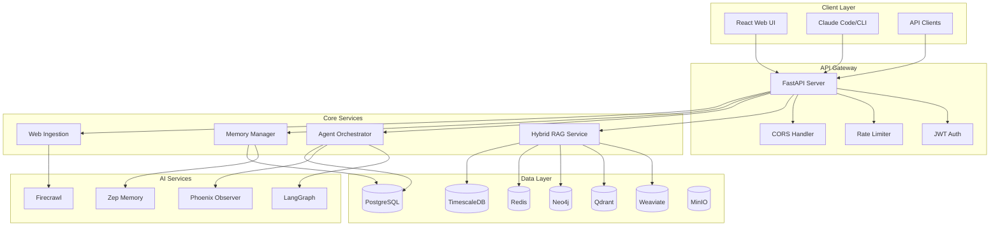

# 🏗️ KnowledgeHub System Architecture

## Architecture Overview



---

## 🎯 Component Architecture

### 1. Client Layer

#### React Web UI
- **Technology**: React 18+, TypeScript, Material-UI
- **Features**: 
  - Real-time workflow visualization
  - Interactive RAG query interface
  - Memory management dashboard
  - Web ingestion monitoring
- **Communication**: REST API + WebSocket for real-time updates

#### Claude Code Integration
- **Protocol**: Model Context Protocol (MCP)
- **Features**:
  - Direct tool integration
  - Session persistence
  - Context synchronization

### 2. API Gateway

#### FastAPI Server
- **Framework**: FastAPI 0.104+
- **Features**:
  - Async request handling
  - OpenAPI documentation
  - WebSocket support
  - Health monitoring
- **Middleware Stack**:
  ```python
  app.add_middleware(CORSMiddleware)
  app.add_middleware(AuthenticationMiddleware)
  app.add_middleware(RateLimitMiddleware)
  app.add_middleware(SecurityHeadersMiddleware)
  app.add_middleware(PrometheusMiddleware)
  ```

### 3. Core Services

#### Hybrid RAG Service
```python
class HybridRAGService:
    """
    Combines multiple retrieval strategies:
    - Dense Vector Search (Weaviate/Qdrant)
    - Sparse Search (BM25)
    - Graph Search (Neo4j)
    - Cross-encoder Reranking
    """
    
    async def query(self, text: str, mode: str = "hybrid"):
        # 1. Dense retrieval
        vector_results = await self.vector_search(text)
        
        # 2. Sparse retrieval
        sparse_results = await self.sparse_search(text)
        
        # 3. Graph retrieval
        graph_results = await self.graph_search(text)
        
        # 4. Fusion and reranking
        final_results = await self.rerank(
            vector_results + sparse_results + graph_results
        )
        
        return final_results
```

#### Agent Orchestrator
```python
class AgentOrchestrator:
    """
    LangGraph-based multi-agent system
    """
    
    agents = {
        "researcher": ResearchAgent(),
        "analyst": AnalysisAgent(),
        "synthesizer": SynthesisAgent(),
        "validator": ValidationAgent()
    }
    
    workflows = {
        "simple_qa": SimpleQAWorkflow(),
        "multi_step_research": MultiStepResearchWorkflow(),
        "comparative_analysis": ComparativeAnalysisWorkflow()
    }
```

---

## 📊 Data Flow Architecture

### Query Processing Pipeline

```
User Query → API Gateway → Hybrid RAG Service
                              ↓
                    [Parallel Processing]
                    ├── Vector Search (Weaviate)
                    ├── Sparse Search (BM25)
                    └── Graph Search (Neo4j)
                              ↓
                         Fusion Layer
                              ↓
                      Cross-encoder Reranking
                              ↓
                         Final Results
```

### Agent Workflow Execution

```
Request → Agent Orchestrator → LangGraph
                                    ↓
                            [State Machine]
                            ├── Initialize
                            ├── Plan
                            ├── Execute
                            ├── Validate
                            └── Complete
                                    ↓
                              Response Stream
```

---

## 🗄️ Database Schema

### PostgreSQL - Primary Database

```sql
-- Core Tables
memories (
    id UUID PRIMARY KEY,
    content TEXT,
    embedding VECTOR(1536),
    metadata JSONB,
    created_at TIMESTAMP
)

sessions (
    id UUID PRIMARY KEY,
    user_id VARCHAR,
    context JSONB,
    created_at TIMESTAMP
)

-- New Hybrid RAG Tables
agent_workflows (
    id UUID PRIMARY KEY,
    workflow_type VARCHAR,
    state JSONB,
    status VARCHAR,
    created_at TIMESTAMP
)

hybrid_rag_sessions (
    id UUID PRIMARY KEY,
    query TEXT,
    results JSONB,
    performance_metrics JSONB,
    created_at TIMESTAMP
)
```

### Neo4j - Knowledge Graph

```cypher
// Node Types
(Document:Entity {id, title, content, embedding})
(Concept:Entity {name, description, category})
(User:Entity {id, name, preferences})

// Relationship Types
(Document)-[:MENTIONS]->(Concept)
(Document)-[:RELATED_TO]->(Document)
(User)-[:QUERIES]->(Document)
(Concept)-[:BROADER_THAN]->(Concept)
```

### TimescaleDB - Analytics

```sql
-- Hypertables for time-series data
CREATE TABLE metrics (
    time TIMESTAMPTZ NOT NULL,
    metric_name TEXT,
    value DOUBLE PRECISION,
    tags JSONB
);

SELECT create_hypertable('metrics', 'time');
```

---

## 🔌 Service Integration

### External Service Connections

| Service | Port | Protocol | Purpose |
|---------|------|----------|---------|
| Zep | 8100 | HTTP/REST | Conversational memory |
| Firecrawl | 3002 | HTTP/REST | Web scraping |
| Graphiti | 8080 | HTTP/REST | GraphRAG enhancement |
| Phoenix | 6006 | HTTP/gRPC | AI observability |
| LangSmith | External | HTTPS | Tracing and evaluation |

### Service Communication Patterns

#### Synchronous Communication
- REST API calls for immediate responses
- GraphQL for complex queries (future)

#### Asynchronous Communication
- Redis pub/sub for event broadcasting
- WebSocket for real-time updates
- Background job queues for long-running tasks

---

## 🔐 Security Architecture

### Authentication & Authorization

```
┌─────────────┐     ┌──────────────┐     ┌───────────────┐
│   Client    │────▶│  API Gateway │────▶│  Auth Service │
└─────────────┘     └──────────────┘     └───────────────┘
                            │                      │
                            ▼                      ▼
                    ┌──────────────┐      ┌──────────────┐
                    │ Rate Limiter │      │ JWT Validator│
                    └──────────────┘      └──────────────┘
```

### Security Layers

1. **Network Security**
   - TLS 1.3 for all external communications
   - Network isolation with Docker networks
   - Firewall rules for port access

2. **Application Security**
   - Input validation and sanitization
   - SQL injection prevention
   - XSS and CSRF protection
   - Security headers (HSTS, CSP, etc.)

3. **Data Security**
   - Encryption at rest (Fernet/AES)
   - Encryption in transit (TLS)
   - Key management with environment variables
   - Secure credential storage

---

## 🚀 Deployment Architecture

### Container Orchestration

```yaml
services:
  api:
    image: knowledgehub-api:latest
    replicas: 3
    resources:
      limits:
        memory: 2G
        cpus: '2'
    healthcheck:
      test: ["CMD", "curl", "-f", "http://localhost:3000/health"]
      
  worker:
    image: knowledgehub-worker:latest
    replicas: 5
    resources:
      limits:
        memory: 4G
        cpus: '4'
```

### Scaling Strategy

#### Horizontal Scaling
- API servers: 1-10 instances
- Worker processes: 1-20 instances
- Database read replicas: 1-5 instances

#### Vertical Scaling
- Memory: 8GB → 64GB based on load
- CPU: 4 cores → 32 cores
- GPU: Optional for AI workloads

---

## 📈 Performance Architecture

### Caching Strategy

```
┌──────────┐     ┌─────────────┐     ┌──────────────┐
│  Request │────▶│ Redis Cache │────▶│ Primary Data │
└──────────┘     └─────────────┘     └──────────────┘
                        │
                        ▼
                 ┌─────────────┐
                 │   Response  │
                 └─────────────┘
```

### Performance Optimizations

1. **Query Optimization**
   - Database indexing
   - Query result caching
   - Connection pooling
   - Prepared statements

2. **Resource Optimization**
   - Lazy loading
   - Batch processing
   - Async I/O operations
   - Memory-mapped files

3. **Network Optimization**
   - HTTP/2 support
   - Compression (gzip, brotli)
   - CDN for static assets
   - WebSocket for real-time

---

## 🔄 Resilience & Recovery

### Fault Tolerance

```
┌─────────────┐
│   Service   │
└──────┬──────┘
       │
   ┌───▼────┐     ┌──────────┐
   │ Healthy│────▶│  Normal  │
   └────────┘     │Operation │
                  └──────────┘
       │
   ┌───▼────┐     ┌──────────┐
   │Degraded│────▶│ Fallback │
   └────────┘     │   Mode   │
                  └──────────┘
       │
   ┌───▼────┐     ┌──────────┐
   │ Failed │────▶│  Circuit │
   └────────┘     │  Breaker │
                  └──────────┘
```

### Backup & Recovery

1. **Data Backup**
   - Automated daily backups
   - Point-in-time recovery
   - Cross-region replication
   - Backup validation

2. **Service Recovery**
   - Health checks with auto-restart
   - Circuit breaker pattern
   - Retry with exponential backoff
   - Graceful degradation

---

## 🔮 Future Architecture Considerations

### Planned Enhancements

1. **Microservices Migration**
   - Decompose monolith into microservices
   - Service mesh (Istio/Linkerd)
   - API gateway (Kong/Traefik)

2. **Kubernetes Deployment**
   - Container orchestration
   - Auto-scaling with HPA
   - Service discovery
   - Config management

3. **Event-Driven Architecture**
   - Event sourcing
   - CQRS pattern
   - Message queues (RabbitMQ/Kafka)
   - Event store

4. **Advanced AI Features**
   - Federated learning
   - Model versioning
   - A/B testing framework
   - AutoML integration

---

*Architecture Version: 2.0.0*  
*Last Updated: August 2025*  
*Status: Production Ready*