# Architecture Diagrams and System Flow

This document provides visual representations of the KnowledgeHub system architecture, data flows, and component interactions.

## 📊 System Overview Diagram

```mermaid
graph TB
    subgraph "External Sources"
        WEB[📄 Documentation Sites]
        GIT[🔧 GitHub Repositories]
        FILE[📁 File Uploads]
    end
    
    subgraph "KnowledgeHub Platform"
        subgraph "Web Layer"
            UI[🖥️ React Frontend]
            API[🔌 FastAPI Backend]
        end
        
        subgraph "Processing Layer"
            SCRAPER[🕷️ Web Scraper]
            RAG[🤖 RAG Processor]
            SCHEDULER[⏰ Job Scheduler]
        end
        
        subgraph "Storage Layer"
            POSTGRES[🐘 PostgreSQL]
            REDIS[⚡ Redis Cache]
            WEAVIATE[🧠 Vector DB]
            MINIO[📦 Object Storage]
        end
    end
    
    subgraph "Infrastructure"
        NGINX[🌐 Nginx Proxy]
        DOCKER[🐳 Docker Containers]
        GPU[⚡ GPU Acceleration]
    end
    
    %% Data Flow
    WEB --> SCRAPER
    GIT --> SCRAPER
    FILE --> API
    
    UI --> API
    API --> POSTGRES
    API --> REDIS
    API --> WEAVIATE
    
    SCRAPER --> RAG
    RAG --> POSTGRES
    RAG --> WEAVIATE
    RAG --> MINIO
    
    SCHEDULER --> SCRAPER
    REDIS --> SCHEDULER
    
    NGINX --> UI
    NGINX --> API
    
    %% Styling
    classDef external fill:#e1f5fe
    classDef web fill:#f3e5f5
    classDef processing fill:#fff3e0
    classDef storage fill:#e8f5e8
    classDef infra fill:#fce4ec
    
    class WEB,GIT,FILE external
    class UI,API web
    class SCRAPER,RAG,SCHEDULER processing
    class POSTGRES,REDIS,WEAVIATE,MINIO storage
    class NGINX,DOCKER,GPU infra
```

## 🔄 Data Processing Flow

## 🏗️ Component Architecture

## 🔍 Search Architecture

## 📱 Frontend Component Hierarchy

## 🔧 Processing Pipeline

## 🚀 Deployment Architecture

## 🔐 Security Architecture

## 📊 Performance Monitoring

## 🔄 Data Synchronization Flow

---

## 📋 Diagram Legend

### 🎨 Color Coding
- **Blue** (`#e3f2fd`): External systems and user interfaces
- **Purple** (`#f3e5f5`): Web layer components (frontend, API)
- **Orange** (`#fff3e0`): Processing and worker services
- **Green** (`#e8f5e8`): Storage and database systems
- **Pink** (`#fce4ec`): Infrastructure and DevOps components

### 🔗 Connection Types
- **Solid Lines**: Direct connections and data flow
- **Dashed Lines**: Indirect connections and dependencies
- **Arrows**: Direction of data flow or communication

### 📊 Component Types
- **Rectangles**: Services and applications
- **Circles**: Databases and storage
- **Diamonds**: Decision points and conditionals
- **Rounded Rectangles**: User interfaces and external systems

---

*This document provides comprehensive visual documentation of the KnowledgeHub architecture. For detailed implementation information, refer to the [Architecture Guide](ARCHITECTURE.md) and [API Documentation](API.md).*