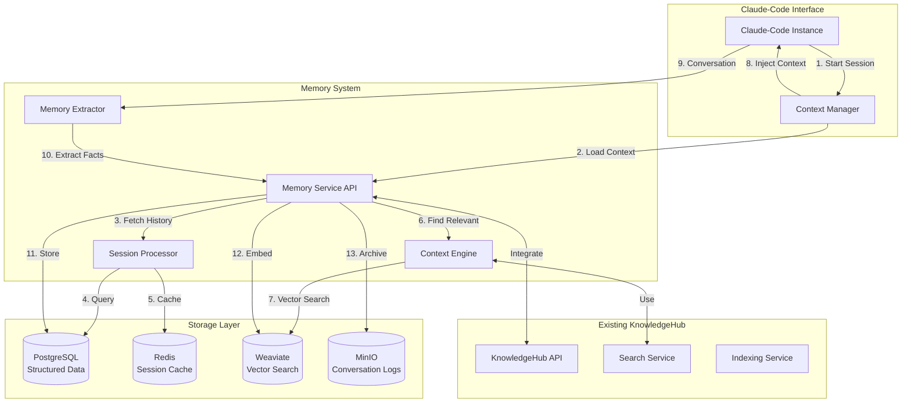

# Claude-Code Persistent Memory Architecture

## Overview

This document outlines the complete architecture for enhancing KnowledgeHub to provide persistent memory and context extension capabilities for Claude-Code across multiple sessions.

## Architecture Vision



## Core Components

### 1. Memory Service API
**Purpose**: Central API for all memory operations
**Endpoints**:
- `POST /api/memory/session/start` - Initialize new session
- `POST /api/memory/session/end` - Close session and process
- `POST /api/memory/context/save` - Save conversation turn
- `GET /api/memory/context/load/{session_id}` - Load session context
- `POST /api/memory/facts/extract` - Extract facts from conversation
- `POST /api/memory/search` - Search across all memories

### 2. Session Processor
**Purpose**: Manage conversation sessions and continuity
**Features**:
- Track active sessions
- Link related conversations
- Manage session metadata
- Handle session expiration

### 3. Context Engine
**Purpose**: Intelligently build context from memories
**Features**:
- Relevance scoring
- Context compression
- Token limit management
- Priority-based selection

### 4. Memory Extractor
**Purpose**: Extract and categorize information from conversations
**Features**:
- Fact extraction
- Entity recognition
- Preference learning
- Code pattern detection

## Data Models

### Session Model
```python
class Session(BaseModel):
    id: str
    user_id: str
    project_id: Optional[str]
    started_at: datetime
    ended_at: Optional[datetime]
    metadata: Dict[str, Any]
    tags: List[str]
    parent_session_id: Optional[str]  # For linked sessions
```

### Memory Model
```python
class Memory(BaseModel):
    id: str
    session_id: str
    content: str
    memory_type: MemoryType  # fact, preference, code, decision, error
    importance: float  # 0.0 to 1.0
    entities: List[str]
    embedding: Optional[List[float]]
    created_at: datetime
    last_accessed: datetime
    access_count: int
```

### Context Model
```python
class Context(BaseModel):
    session_id: str
    recent_messages: List[Message]
    relevant_memories: List[Memory]
    project_facts: List[Fact]
    user_preferences: List[Preference]
    total_tokens: int
```

## Implementation Phases

### Phase 1: Basic Session Management
- Session tracking
- Conversation storage
- Basic retrieval

### Phase 2: Intelligent Memory Extraction
- Fact extraction
- Entity recognition
- Importance scoring

### Phase 3: Context Building
- Relevance ranking
- Context compression
- Token optimization

### Phase 4: Advanced Features
- Memory decay
- Relationship graphs
- Pattern learning

## Integration Points

### With Existing KnowledgeHub
1. **Search Integration**: Use existing search for memory retrieval
2. **Storage Reuse**: Leverage existing PostgreSQL/Redis/Weaviate
3. **API Extension**: Add memory endpoints to existing API

### With Claude-Code
1. **Startup Hook**: Load context at session start
2. **Continuous Save**: Stream conversation to memory
3. **Smart Retrieval**: Context-aware memory injection

## Technical Implementation

### Memory Service Structure
```
/opt/projects/knowledgehub/src/memory_system/
├── api/
│   ├── __init__.py
│   ├── routers/
│   │   ├── session.py
│   │   ├── memory.py
│   │   └── context.py
│   └── dependencies.py
├── core/
│   ├── __init__.py
│   ├── session_manager.py
│   ├── memory_extractor.py
│   ├── context_builder.py
│   └── relevance_scorer.py
├── models/
│   ├── __init__.py
│   ├── session.py
│   ├── memory.py
│   └── context.py
├── services/
│   ├── __init__.py
│   ├── extraction_service.py
│   ├── compression_service.py
│   └── ranking_service.py
└── utils/
    ├── __init__.py
    ├── token_counter.py
    └── text_processor.py
```

### Database Schema
```sql
-- Sessions table
CREATE TABLE sessions (
    id UUID PRIMARY KEY DEFAULT gen_random_uuid(),
    user_id VARCHAR(255) NOT NULL,
    project_id UUID,
    started_at TIMESTAMP NOT NULL DEFAULT NOW(),
    ended_at TIMESTAMP,
    metadata JSONB,
    tags TEXT[],
    parent_session_id UUID REFERENCES sessions(id)
);

-- Memories table
CREATE TABLE memories (
    id UUID PRIMARY KEY DEFAULT gen_random_uuid(),
    session_id UUID REFERENCES sessions(id),
    content TEXT NOT NULL,
    memory_type VARCHAR(50) NOT NULL,
    importance FLOAT DEFAULT 0.5,
    entities TEXT[],
    created_at TIMESTAMP DEFAULT NOW(),
    last_accessed TIMESTAMP DEFAULT NOW(),
    access_count INTEGER DEFAULT 0,
    metadata JSONB
);

-- Indexes
CREATE INDEX idx_memories_session ON memories(session_id);
CREATE INDEX idx_memories_type ON memories(memory_type);
CREATE INDEX idx_memories_importance ON memories(importance DESC);
CREATE INDEX idx_memories_entities ON memories USING GIN(entities);
```

## API Examples

### Starting a Session
```bash
curl -X POST http://localhost:3000/api/memory/session/start \
  -H "Content-Type: application/json" \
  -d '{
    "user_id": "user123",
    "project_id": "proj456",
    "metadata": {
      "client": "claude-code",
      "purpose": "React development"
    }
  }'
```

### Saving Context
```bash
curl -X POST http://localhost:3000/api/memory/context/save \
  -H "Content-Type: application/json" \
  -d '{
    "session_id": "session789",
    "message": {
      "role": "assistant",
      "content": "To implement authentication, you should use JWT tokens..."
    },
    "extracted_facts": [
      "User is implementing authentication",
      "Project uses JWT tokens"
    ]
  }'
```

### Loading Context for New Session
```bash
curl -X GET http://localhost:3000/api/memory/context/load/session789?max_tokens=2000
```

## Performance Considerations

1. **Caching Strategy**
   - Hot sessions in Redis
   - Recent memories in-memory
   - Background synchronization

2. **Vector Search Optimization**
   - Pre-computed embeddings
   - Indexed entity relationships
   - Batch processing

3. **Context Size Management**
   - Dynamic token allocation
   - Priority-based truncation
   - Compression algorithms

## Security & Privacy

1. **Data Isolation**
   - User-level separation
   - Project boundaries
   - Session encryption

2. **Access Control**
   - API key per user
   - Session tokens
   - Audit logging

3. **Data Retention**
   - Configurable retention periods
   - Automatic purging
   - Export capabilities

## Monitoring & Analytics

1. **Memory Metrics**
   - Memory usage per user
   - Context hit rates
   - Extraction accuracy

2. **Performance Metrics**
   - Context build time
   - Search latency
   - Token efficiency

3. **Usage Analytics**
   - Session patterns
   - Memory types distribution
   - Feature adoption

## Future Enhancements

1. **Multi-Agent Memory**
   - Shared team memories
   - Role-based contexts
   - Collaborative sessions

2. **Advanced Learning**
   - Pattern recognition
   - Preference evolution
   - Predictive context

3. **External Integrations**
   - IDE plugins
   - Git integration
   - Documentation sync