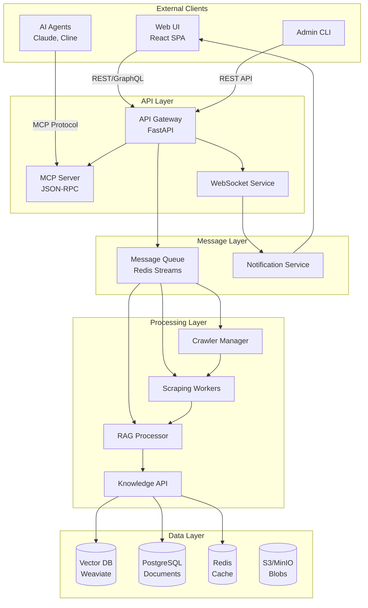
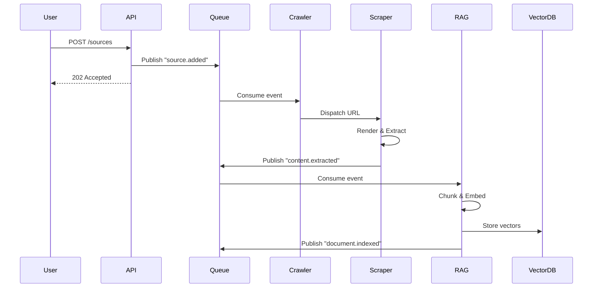
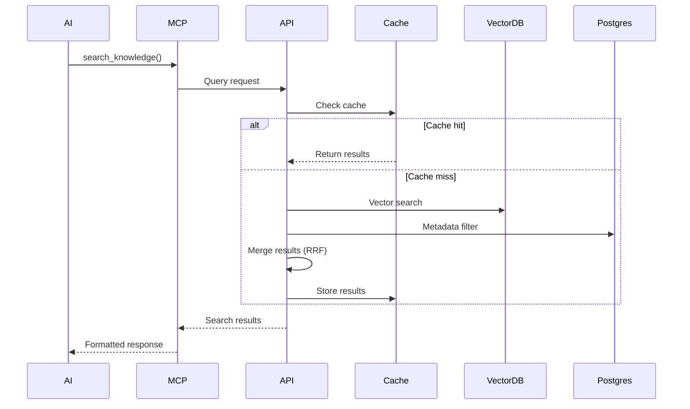

# AI Knowledge Hub - Architecture Documentation

## Table of Contents

1. [System Overview](#system-overview)
2. [Architectural Principles](#architectural-principles)
3. [Component Architecture](#component-architecture)
4. [Data Flow](#data-flow)
5. [Technology Decisions](#technology-decisions)
6. [Scalability Strategy](#scalability-strategy)
7. [Security Architecture](#security-architecture)

## System Overview

The AI Knowledge Hub is designed as a distributed, event-driven system that provides persistent memory and knowledge management capabilities for AI agents. The architecture prioritizes scalability, reliability, and flexibility while maintaining the ability to run in both local and cloud environments.

### High-Level Architecture



## Architectural Principles

### 1. Event-Driven Architecture

The system adopts an event-driven architecture to handle long-running operations asynchronously:

- **Decoupling**: Services communicate through events, reducing direct dependencies
- **Scalability**: Workers can be scaled independently based on queue depth
- **Resilience**: Failed operations can be retried without affecting other components
- **Observability**: Event streams provide natural audit trails

### 2. Microservices Design

Each component is designed as an independent microservice:

- **Single Responsibility**: Each service has a clearly defined purpose
- **Independent Deployment**: Services can be updated without affecting others
- **Technology Agnostic**: Services communicate through standard protocols
- **Fault Isolation**: Failures are contained within service boundaries

### 3. API-First Development

All functionality is exposed through well-defined APIs:

- **OpenAPI Specification**: All REST endpoints are documented
- **MCP Protocol**: Standardized interface for AI agents
- **GraphQL Option**: Complex queries for advanced use cases
- **Versioning**: API versions ensure backward compatibility

## Component Architecture

### API Gateway (FastAPI)

The API Gateway serves as the single entry point for all external requests:

```python
# Core structure
app = FastAPI(
    title="AI Knowledge Hub API",
    version="1.0.0",
    docs_url="/api/docs"
)

# Middleware stack
app.add_middleware(CORSMiddleware, allow_origins=["*"])
app.add_middleware(RateLimitMiddleware, requests_per_minute=100)
app.add_middleware(AuthenticationMiddleware)
app.add_middleware(RequestLoggingMiddleware)

# Route organization
app.include_router(sources_router, prefix="/api/v1/sources")
app.include_router(search_router, prefix="/api/v1/search")
app.include_router(jobs_router, prefix="/api/v1/jobs")
app.mount("/mcp", mcp_app)  # MCP WebSocket endpoint
```

### MCP Server Implementation

The MCP server provides a standardized interface for AI agents:

```python
class KnowledgeHubMCPServer:
    def __init__(self):
        self.mcp = FastMCP("Knowledge Hub Server")
        self.setup_tools()
    
    def setup_tools(self):
        @self.mcp.tool()
        async def search_knowledge(
            query: str,
            filters: Dict[str, Any] = None,
            limit: int = 10
        ) -> str:
            """Search the knowledge base"""
            results = await self.knowledge_api.hybrid_search(
                query=query,
                filters=filters,
                limit=limit
            )
            return json.dumps(results, indent=2)
        
        @self.mcp.tool()
        async def store_memory(
            content: str,
            metadata: Dict[str, Any] = None
        ) -> str:
            """Store information in memory"""
            memory_id = await self.memory_manager.store(
                content=content,
                metadata=metadata
            )
            return f"Stored with ID: {memory_id}"
        
        @self.mcp.resource("memory://context")
        async def get_context() -> str:
            """Get current context window"""
            return await self.context_manager.get_current()
```

### Scraping Engine Architecture

The scraping engine uses a distributed worker pattern:

```python
class ScrapingWorker:
    def __init__(self):
        self.browser_pool = BrowserPool(max_browsers=5)
        self.rate_limiter = TokenBucket(rate=1, capacity=10)
    
    async def process_job(self, job: ScrapingJob):
        async with self.browser_pool.acquire() as browser:
            page = await browser.new_page()
            
            # Configure stealth mode
            await stealth_async(page)
            
            # Handle authentication if needed
            if job.requires_auth:
                await self.handle_authentication(page, job.auth_config)
            
            # Extract content with structure preservation
            content = await self.extract_structured_content(page)
            
            # Publish to RAG processor
            await self.publish_content(content)
```

### RAG Processor Pipeline

The RAG processor implements intelligent chunking and embedding:

```python
class RAGProcessor:
    def __init__(self):
        self.chunker = HybridChunker()
        self.embedder = EmbeddingService()
        
    async def process_document(self, document: Document):
        # Stage 1: Structure-aware chunking
        chunks = await self.chunker.chunk_document(document)
        
        # Stage 2: Generate embeddings
        for chunk in chunks:
            chunk.embedding = await self.embedder.embed(chunk.text)
            
        # Stage 3: Metadata enrichment
        chunks = self.enrich_metadata(chunks, document)
        
        # Stage 4: Persist to vector store
        await self.vector_store.batch_insert(chunks)
```

## Data Flow

### 1. Document Ingestion Flow



### 2. Search Query Flow



## Technology Decisions

### Vector Database Selection: Weaviate

After comparing multiple options, Weaviate was selected for the following reasons:

| Feature | Weaviate | Alternatives | Decision Rationale |
|---------|----------|--------------|-------------------|
| CRUD Support | Full real-time CRUD | Limited in some | Essential for dynamic knowledge management |
| Hybrid Search | Native support | Often requires custom | Critical for technical documentation |
| Scalability | Horizontal scaling | Varies | Supports growth from local to enterprise |
| Open Source | Yes | Mixed | Avoids vendor lock-in |

### Web Framework: FastAPI

FastAPI was chosen over alternatives like Express.js or Flask:

- **Performance**: ASGI-based with async support
- **Developer Experience**: Automatic OpenAPI generation
- **Type Safety**: Python type hints for validation
- **Ecosystem**: Native Python integration with ML libraries

### Message Queue: Redis Streams

Redis Streams provides the ideal balance for our event-driven needs:

- **Simplicity**: Easier to operate than Kafka for smaller scales
- **Performance**: Sub-millisecond latency
- **Persistence**: Can persist messages unlike traditional pub/sub
- **Consumer Groups**: Built-in support for distributed processing

## Scalability Strategy

### Horizontal Scaling Points

1. **Scraping Workers**: Scale based on queue depth
2. **RAG Processors**: Scale based on processing latency
3. **API Instances**: Scale based on request rate
4. **Vector Database**: Shard by source or document type

### Deployment Patterns

#### Local Development (Docker Compose)
```yaml
version: '3.8'
services:
  api:
    build: ./src/api
    ports:
      - "3000:3000"
    environment:
      - ENV=development
    depends_on:
      - postgres
      - redis
      - weaviate
```

#### Production (Kubernetes)
```yaml
apiVersion: apps/v1
kind: Deployment
metadata:
  name: api-gateway
spec:
  replicas: 3
  template:
    spec:
      containers:
      - name: api
        image: knowledge-hub/api:latest
        resources:
          requests:
            memory: "512Mi"
            cpu: "500m"
          limits:
            memory: "1Gi"
            cpu: "1000m"
```

### Performance Targets

- **Search Latency**: < 100ms (p95)
- **Ingestion Throughput**: > 1000 pages/minute
- **Concurrent Users**: 1000+
- **Document Capacity**: 10M+ chunks

## Security Architecture

### Authentication & Authorization

```python
# Multi-layer security model
class SecurityMiddleware:
    async def authenticate(self, request: Request):
        # Layer 1: API Key validation
        api_key = request.headers.get("X-API-Key")
        if api_key:
            return await self.validate_api_key(api_key)
        
        # Layer 2: JWT token validation
        token = request.headers.get("Authorization")
        if token:
            return await self.validate_jwt(token)
        
        # Layer 3: MCP authentication
        if request.path.startswith("/mcp"):
            return await self.validate_mcp_session(request)
        
        raise UnauthorizedException()
```

### Data Security

1. **Encryption at Rest**: All databases use encryption
2. **Encryption in Transit**: TLS 1.3 for all communications
3. **Input Validation**: Strict schema validation on all inputs
4. **Rate Limiting**: Prevent abuse and DDoS
5. **Audit Logging**: All data modifications are logged

### Network Security

```yaml
# Kubernetes NetworkPolicy
apiVersion: networking.k8s.io/v1
kind: NetworkPolicy
metadata:
  name: api-gateway-policy
spec:
  podSelector:
    matchLabels:
      app: api-gateway
  policyTypes:
  - Ingress
  - Egress
  ingress:
  - from:
    - podSelector:
        matchLabels:
          app: nginx-ingress
    ports:
    - protocol: TCP
      port: 3000
```

## Monitoring & Observability

### Metrics Collection
```python
# Prometheus metrics
from prometheus_client import Counter, Histogram, Gauge

# Request metrics
request_count = Counter('http_requests_total', 'Total HTTP requests')
request_duration = Histogram('http_request_duration_seconds', 'Request duration')

# Business metrics
documents_indexed = Counter('documents_indexed_total', 'Total documents indexed')
search_queries = Counter('search_queries_total', 'Total search queries')
active_sources = Gauge('active_sources', 'Number of active knowledge sources')
```

### Distributed Tracing
```python
# OpenTelemetry integration
from opentelemetry import trace

tracer = trace.get_tracer(__name__)

@app.post("/api/v1/search")
async def search(query: SearchQuery):
    with tracer.start_as_current_span("search_request") as span:
        span.set_attribute("query.text", query.text)
        span.set_attribute("query.limit", query.limit)
        
        # Trace through the entire request lifecycle
        results = await knowledge_api.search(query)
        
        span.set_attribute("results.count", len(results))
        return results
```

## Conclusion

This architecture provides a robust foundation for building a scalable, maintainable knowledge management system. The design balances flexibility with performance, allowing the system to start small and grow to enterprise scale while maintaining operational simplicity.