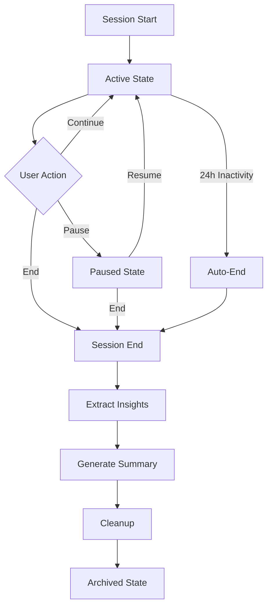

# Session Lifecycle Management

## Overview

The Session Lifecycle Management system provides comprehensive control over memory session lifecycles, including intelligent session initialization, state transitions, graceful termination, and insights extraction.

## Architecture

### Core Components

1. **SessionLifecycleManager** (`src/api/memory_system/core/session_lifecycle.py`)
   - Complete lifecycle orchestration
   - Session state management
   - Insights and analytics extraction
   - Automatic cleanup scheduling

2. **Enhanced Session Endpoints** (`src/api/memory_system/api/routers/session_lifecycle.py`)
   - `/lifecycle/start` - Enhanced session initialization
   - `/lifecycle/{id}/end` - Graceful session termination
   - `/lifecycle/{id}/state` - Session health monitoring
   - `/lifecycle/{id}/insights` - Analytics extraction
   - `/lifecycle/{id}/transition` - State transitions

3. **Session Model Updates**
   - Timezone-aware datetime handling
   - Enhanced metadata management
   - State tracking capabilities

## Features

### 1. Enhanced Session Start

```python
POST /api/memory/lifecycle/start
{
  "user_id": "user-123",
  "project_id": null,
  "metadata": {"purpose": "code review"},
  "tags": ["review", "python"],
  "auto_link": true,
  "context_window": 50
}
```

Features:
- **Automatic Session Linking**: Links to recent active sessions
- **Parent Context Preservation**: Inherits context from parent sessions
- **Welcome Memory Creation**: Initializes first sessions with welcome message
- **Background Cleanup Scheduling**: Auto-cleanup after 24 hours of inactivity
- **State Initialization**: Sets initial parameters and metadata

### 2. Graceful Session End

```python
POST /api/memory/lifecycle/{session_id}/end
{
  "reason": "normal",  # normal, timeout, error, user_requested
  "final_summary": "Completed code review with 5 improvements identified"
}
```

Features:
- **Pre-end Validation**: Flushes pending memories
- **Insights Extraction**: Extracts topics, decisions, errors, learning points
- **Summary Generation**: Creates natural language session summary
- **Analytics Events**: Triggers monitoring events
- **Cleanup Tasks**: Removes temporary data

### 3. Session State Monitoring

```python
GET /api/memory/lifecycle/{session_id}/state
```

Response:
```json
{
  "session_id": "uuid",
  "state": "active",
  "is_active": true,
  "health_status": "warning",
  "memory_count": 150,
  "duration_minutes": 45.5,
  "last_activity": "2025-07-08T12:30:00Z",
  "warnings": [
    "No activity for 30 minutes",
    "High memory count: 150"
  ]
}
```

Health Indicators:
- Session duration warnings (>4 hours)
- Memory count warnings (>500)
- Inactivity detection (>60 minutes)

### 4. Session Insights

```python
GET /api/memory/lifecycle/{session_id}/insights
```

Extracted Analytics:
- **Topics**: Main subjects discussed (entity-based)
- **Key Decisions**: Decisions made during session
- **Errors Encountered**: Problems and solutions
- **Learning Points**: Important facts and patterns
- **Action Items**: TODOs and tasks identified
- **Entity Summary**: Unique entities mentioned

### 5. State Transitions

```python
POST /api/memory/lifecycle/{session_id}/transition?new_state=paused
```

Supported Transitions:
- `active` → `paused`: Temporarily pause session
- `paused` → `active`: Resume paused session
- `ended` → `archived`: Archive completed session

## Session Lifecycle Flow



## Implementation Details

### Session Initialization Process

1. **Active Session Check**: Prevents duplicate active sessions
2. **Parent Session Linking**: Maintains conversation continuity
3. **State Initialization**: Sets default parameters
4. **Welcome Memory**: Creates initial context
5. **Background Tasks**: Schedules health monitoring

### Session Termination Process

1. **Pre-end Tasks**: Ensure data consistency
2. **Statistics Calculation**: Compute final metrics
3. **Insights Extraction**: Analyze session content
4. **Summary Generation**: Create human-readable summary
5. **Cache Updates**: Refresh cached data
6. **Cleanup**: Remove temporary data

### Automatic Features

1. **Auto-Linking**: Automatically links sessions from same user
2. **Inactivity Timeout**: Auto-ends sessions after 24 hours
3. **Health Monitoring**: Background task checks session health
4. **Cache Management**: 1-hour cache TTL for session data

## API Examples

### Complete Session Lifecycle

```python
import aiohttp
import asyncio

async def complete_session_lifecycle():
    async with aiohttp.ClientSession() as session:
        # 1. Start enhanced session
        start_resp = await session.post(
            "http://localhost:3000/api/memory/lifecycle/start",
            json={
                "user_id": "developer-123",
                "metadata": {"project": "feature-x"},
                "tags": ["development"],
                "auto_link": True
            }
        )
        session_data = await start_resp.json()
        session_id = session_data["id"]
        
        # 2. Create memories during work...
        
        # 3. Check session health
        health_resp = await session.get(
            f"http://localhost:3000/api/memory/lifecycle/{session_id}/state"
        )
        health_data = await health_resp.json()
        print(f"Health: {health_data['health_status']}")
        
        # 4. Extract insights before ending
        insights_resp = await session.get(
            f"http://localhost:3000/api/memory/lifecycle/{session_id}/insights"
        )
        insights = await insights_resp.json()
        print(f"Topics: {insights['topics']}")
        
        # 5. End session gracefully
        end_resp = await session.post(
            f"http://localhost:3000/api/memory/lifecycle/{session_id}/end",
            json={
                "reason": "normal",
                "final_summary": "Completed feature X implementation"
            }
        )
```

### Session State Management

```python
# Pause active work
await session.post(
    f"http://localhost:3000/api/memory/lifecycle/{session_id}/transition",
    params={"new_state": "paused"}
)

# Resume later
await session.post(
    f"http://localhost:3000/api/memory/lifecycle/{session_id}/transition",
    params={"new_state": "active"}
)
```

## Configuration

### Session Parameters

```python
{
  "max_memories": 1000,        # Maximum memories per session
  "context_window": 50,        # Memories to include in context
  "importance_threshold": 0.7, # Minimum importance for context
  "auto_cleanup": true,        # Enable automatic cleanup
  "inactivity_timeout": 24     # Hours before auto-end
}
```

### Health Thresholds

- **Duration Warning**: 240 minutes (4 hours)
- **Memory Count Warning**: 500 memories
- **Inactivity Warning**: 60 minutes

## Error Handling

### Common Errors

1. **Session Not Found**: Invalid session ID
2. **Invalid State Transition**: Unsupported state change
3. **Already Ended**: Attempting to end finished session
4. **Database Errors**: Transaction failures

### Recovery Procedures

1. **Failed Session Start**: Retry with exponential backoff
2. **Failed Session End**: Data preserved, manual cleanup possible
3. **Lost Parent Context**: Graceful degradation, continues without

## Monitoring & Analytics

### Metrics Tracked

- Session duration
- Memory count per session
- Important memory ratio
- Entity diversity
- Error frequency
- Decision density

### Analytics Events

- `session_started`: New session initialized
- `session_ended`: Session terminated
- `session_transitioned`: State change
- `health_warning`: Health threshold exceeded

## Best Practices

1. **Always End Sessions**: Use proper end endpoint for insights
2. **Monitor Health**: Check warnings during long sessions
3. **Use Tags**: Organize sessions with meaningful tags
4. **Provide Summaries**: Add final summaries for context
5. **Handle Transitions**: Pause/resume for breaks

## Testing

Run the comprehensive test suite:

```bash
python3 test_session_lifecycle.py
```

Tests cover:
- Enhanced session start with auto-linking
- Session state monitoring and warnings
- Insights extraction
- State transitions
- Graceful session end
- Automatic session linking

## Future Enhancements

1. **Session Templates**: Pre-configured session types
2. **Collaborative Sessions**: Multi-user support
3. **Session Export**: Download session history
4. **Advanced Analytics**: ML-based insights
5. **Custom Health Rules**: Configurable thresholds
