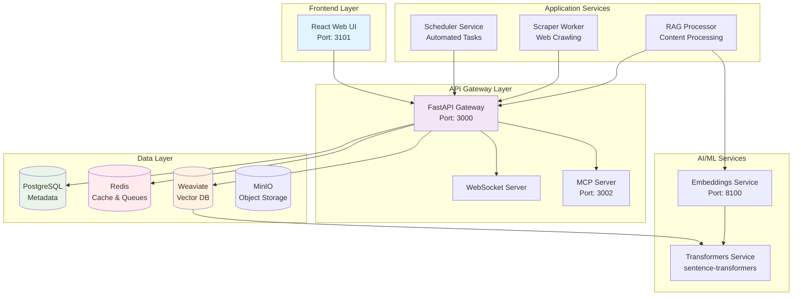
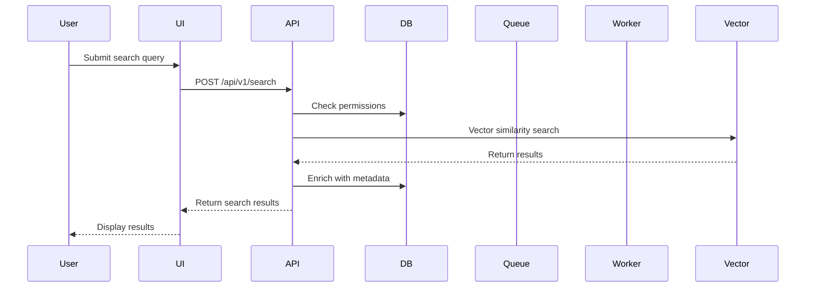
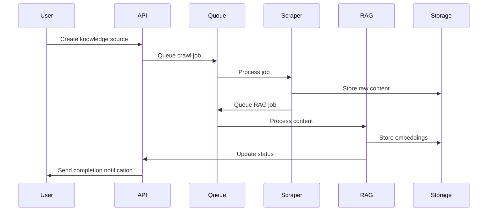
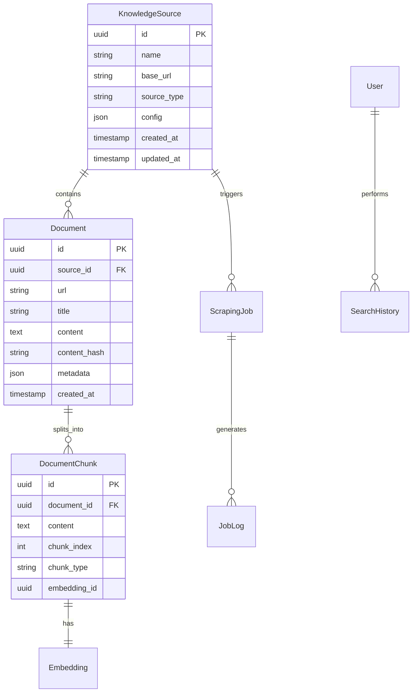
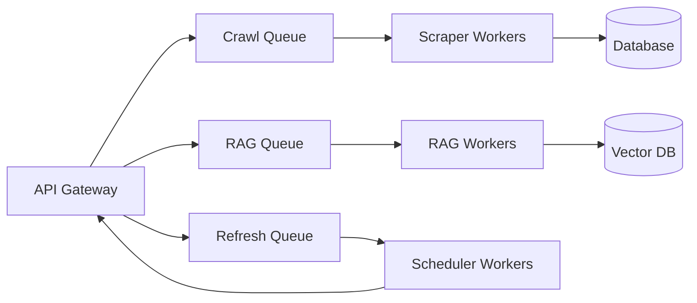
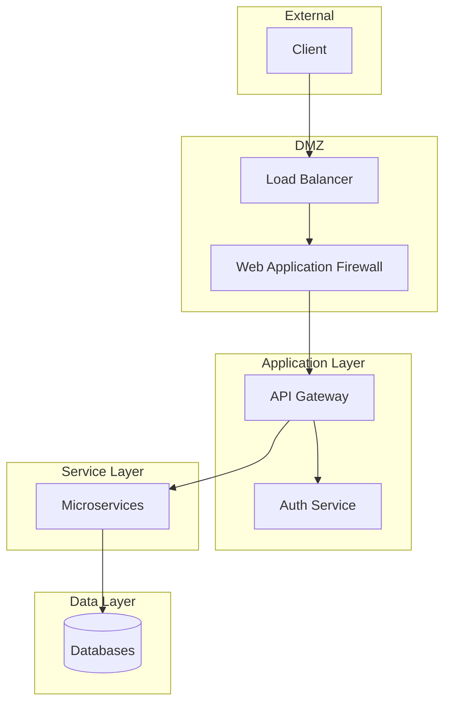

# Architecture Overview

KnowledgeHub is a modern, cloud-native knowledge management system built using a microservices architecture. This document provides a comprehensive overview of the system design, components, and interactions.

## Table of Contents

- [System Overview](#system-overview)
- [Microservices Architecture](#microservices-architecture)
- [Service Interactions](#service-interactions)
- [Data Flow](#data-flow)
- [Database Design](#database-design)
- [API Gateway Pattern](#api-gateway-pattern)
- [Background Processing](#background-processing)
- [Real-time Communication](#real-time-communication)
- [Storage Architecture](#storage-architecture)
- [Security Architecture](#security-architecture)
- [Deployment Architecture](#deployment-architecture)
- [Scalability Considerations](#scalability-considerations)

## System Overview

KnowledgeHub provides intelligent document processing, vector-based search, and AI-powered content understanding capabilities through a distributed microservices architecture.

### High-Level Architecture Diagram



## Microservices Architecture

### Service Catalog

| Service | Technology | Port | Purpose | Dependencies |
|---------|------------|------|---------|--------------|
| **API Gateway** | FastAPI | 3000 | Central API hub, request routing | PostgreSQL, Redis, Weaviate |
| **Web UI** | React + TypeScript | 3101 | User interface | API Gateway |
| **MCP Server** | WebSocket + JSON-RPC | 3002 | Model Context Protocol | API Gateway |
| **Scraper Worker** | Playwright + HTTPX | - | Web content extraction | API Gateway, Redis |
| **RAG Processor** | Python + Transformers | - | Content chunking & embeddings | API Gateway, Embeddings Service |
| **Scheduler** | APScheduler | - | Automated task execution | API Gateway |
| **Embeddings Service** | sentence-transformers | 8100 | Vector generation | - |
| **Transformers Service** | Weaviate Plugin | - | Model inference | - |

### Service Responsibilities

#### 1. API Gateway (`api`)
**Primary Responsibilities:**
- Central request routing and validation
- Authentication and authorization 
- Rate limiting and throttling
- Business logic orchestration
- Database transaction management

**Key Features:**
- RESTful API endpoints
- WebSocket support for real-time updates
- OpenAPI/Swagger documentation
- Health check endpoints
- Prometheus metrics exposure

#### 2. Web UI (`web-ui`)
**Primary Responsibilities:**
- User interface for all functionality
- Real-time updates via WebSocket
- Responsive design for all devices
- Progressive Web App capabilities

**Technology Stack:**
- React 18 with TypeScript
- Vite for build tooling
- TanStack Query for data fetching
- Tailwind CSS for styling

#### 3. Scraper Worker (`scraper`)
**Primary Responsibilities:**
- Web content extraction
- JavaScript rendering with Playwright
- Content deduplication
- Rate limiting and politeness
- Error handling and retries

**Key Features:**
- Incremental crawling with SHA-256 hashing
- Configurable depth and page limits
- Pattern-based URL filtering
- Cookie and session management

#### 4. RAG Processor (`rag-processor`)
**Primary Responsibilities:**
- Document chunking and segmentation
- Embedding generation
- Vector storage management
- Content preprocessing

**Processing Pipeline:**
1. Content extraction
2. Text cleaning and normalization
3. Semantic chunking
4. Embedding generation
5. Vector storage in Weaviate

#### 5. Scheduler Service (`scheduler`)
**Primary Responsibilities:**
- Automated task scheduling
- Periodic source refreshes
- Job queue management
- Retry logic for failed jobs

## Service Interactions

### Request Flow



### Crawling Flow



## Data Flow

### Content Processing Pipeline

1. **Content Acquisition**
   - Web scraping with Playwright
   - API integrations
   - File uploads

2. **Content Processing**
   - Text extraction
   - Metadata extraction
   - Content cleaning

3. **Chunking & Segmentation**
   - Semantic chunking
   - Overlap management
   - Context preservation

4. **Embedding Generation**
   - Batch processing
   - GPU acceleration
   - Caching for efficiency

5. **Storage & Indexing**
   - Vector storage in Weaviate
   - Metadata in PostgreSQL
   - Raw content in MinIO

## Database Design

### Entity Relationship Diagram



### Key Tables

#### `knowledge_sources`
- Stores configuration for each knowledge source
- Tracks crawling parameters and schedules
- Maintains source metadata

#### `documents`
- Stores processed documents
- Content hash for deduplication
- Full-text search capabilities

#### `document_chunks`
- Semantic chunks of documents
- References to vector embeddings
- Maintains document structure

#### `scraping_jobs`
- Job queue and status tracking
- Progress monitoring
- Error tracking and retries

## API Gateway Pattern

The API Gateway serves as the single entry point for all client requests:

### Responsibilities

1. **Request Routing**
   - Route to appropriate microservices
   - Load balancing
   - Service discovery

2. **Cross-cutting Concerns**
   - Authentication/Authorization
   - Rate limiting
   - Request/Response transformation
   - Logging and monitoring

3. **Protocol Translation**
   - REST to gRPC
   - WebSocket management
   - Request aggregation

### API Design Principles

- RESTful design
- Consistent error handling
- Versioned endpoints
- HATEOAS where applicable
- OpenAPI specification

## Background Processing

### Queue Architecture



### Job Types

1. **Crawl Jobs**
   - Web scraping tasks
   - Configurable concurrency
   - Progress tracking

2. **RAG Processing Jobs**
   - Content chunking
   - Embedding generation
   - Vector storage

3. **Refresh Jobs**
   - Incremental updates
   - Change detection
   - Scheduled execution

## Real-time Communication

### WebSocket Architecture

- Full-duplex communication
- Event-driven updates
- Connection management
- Automatic reconnection

### Event Types

```javascript
// Job progress events
{
  "type": "job.progress",
  "job_id": "123",
  "progress": 75,
  "status": "processing"
}

// Search updates
{
  "type": "search.update",
  "source_id": "456",
  "new_documents": 10
}

// System notifications
{
  "type": "system.notification",
  "message": "Maintenance scheduled",
  "severity": "info"
}
```

## Storage Architecture

### Storage Layers

1. **PostgreSQL**
   - Relational data
   - ACID transactions
   - Complex queries

2. **Redis**
   - Caching layer
   - Job queues
   - Session storage
   - Real-time data

3. **Weaviate**
   - Vector embeddings
   - Similarity search
   - AI-powered queries

4. **MinIO**
   - Object storage
   - Raw content
   - Backups
   - Media files

### Data Partitioning Strategy

- Horizontal scaling for large datasets
- Time-based partitioning for logs
- Source-based sharding for content

## Security Architecture

### Security Layers



### Security Features

1. **Authentication & Authorization**
   - JWT-based authentication
   - Role-based access control
   - API key management

2. **Data Protection**
   - Encryption at rest
   - TLS for data in transit
   - Secrets management

3. **Security Monitoring**
   - Audit logging
   - Intrusion detection
   - Vulnerability scanning

## Deployment Architecture

### Container Orchestration

```yaml
# Docker Compose deployment
services:
  api:
    image: knowledgehub/api:latest
    replicas: 3
    resources:
      limits:
        memory: 2G
        cpus: '2'
    
  scraper:
    image: knowledgehub/scraper:latest
    replicas: 2
    resources:
      limits:
        memory: 4G
        cpus: '2'
        
  rag-processor:
    image: knowledgehub/rag:latest
    replicas: 2
    deploy:
      placement:
        constraints:
          - node.labels.gpu == true
```

### High Availability

- Service replication
- Health checks
- Automatic failover
- Rolling updates
- Blue-green deployments

## Scalability Considerations

### Horizontal Scaling

1. **Stateless Services**
   - API Gateway
   - Workers
   - Web UI

2. **Scaling Strategies**
   - Auto-scaling based on metrics
   - Queue depth monitoring
   - CPU/Memory thresholds

### Vertical Scaling

1. **Database Optimization**
   - Query optimization
   - Index tuning
   - Connection pooling

2. **Resource Allocation**
   - GPU for ML workloads
   - Memory for caching
   - CPU for concurrent processing

### Performance Optimization

1. **Caching Strategy**
   - Multi-level caching
   - CDN for static assets
   - Query result caching

2. **Async Processing**
   - Non-blocking I/O
   - Message queues
   - Event-driven architecture

## Future Architecture Considerations

### Planned Enhancements

1. **Multi-region Support**
   - Geographic distribution
   - Data replication
   - Edge computing

2. **Advanced AI Features**
   - Custom model training
   - Federated learning
   - Real-time inference

3. **Enterprise Features**
   - Multi-tenancy
   - Advanced analytics
   - Compliance tools

## Conclusion

KnowledgeHub's architecture is designed for scalability, maintainability, and performance. The microservices approach allows for independent scaling and development of components while maintaining system cohesion through well-defined interfaces and communication patterns.

For more details on specific components, see:
- [API Documentation](API-Documentation)
- [Database Schema](Database-Schema)
- [Deployment Guide](Deployment)
- [Security Guide](Security)