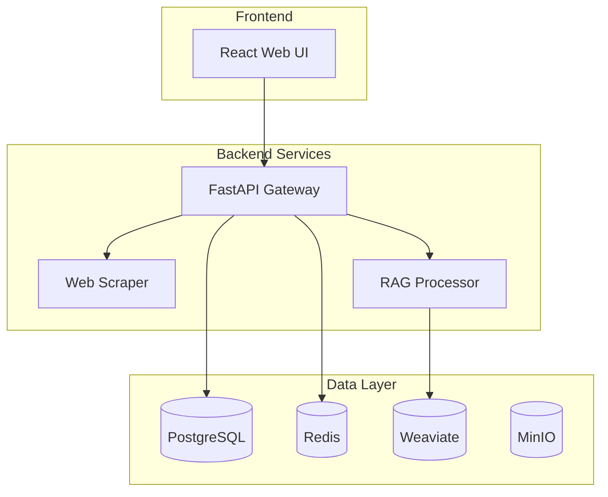

# Welcome to KnowledgeHub Wiki

**An intelligent, production-ready knowledge management system powered by AI**

## 📚 Documentation

### Getting Started
- **[Installation Guide](Installation)** - Step-by-step setup instructions
- **[Quick Start Guide](Quick-Start)** - Get up and running in minutes
- **[Configuration Guide](Configuration)** - Detailed configuration options

### User Documentation
- **[User Guide](User-Guide)** - Complete guide for end users
- **[Tutorials](Tutorials)** - Step-by-step tutorials for common tasks
- **[FAQ](FAQ)** - Frequently asked questions

### Developer Documentation
- **[Architecture Overview](Architecture)** - System design and components
- **[API Documentation](API-Documentation)** - RESTful API reference
- **[Development Guide](Development)** - Setting up development environment

### Advanced Topics
- **[Incremental Crawling](Incremental-Crawling)** - Advanced crawling features
- **[Performance Tuning](Performance)** - Optimization and scaling
- **[Security Guide](Security)** - Security best practices

### Operations
- **[Deployment Guide](Deployment)** - Production deployment instructions
- **[Monitoring & Maintenance](Monitoring)** - System monitoring and maintenance
- **[Troubleshooting](Troubleshooting)** - Common issues and solutions

## 🌟 Key Features

### 🚀 Intelligent Web Crawling
- **95%+ Faster Updates**: Incremental crawling with SHA-256 content hashing
- **Smart Content Extraction**: JavaScript-enabled crawling with Playwright
- **Configurable Limits**: Depth, page count, and pattern filtering

### 🔍 Advanced AI Search
- **Hybrid Search**: Combines semantic and keyword search
- **Vector Embeddings**: sentence-transformers with 384-dimensional vectors
- **Real-time Results**: Sub-second search performance

### 🏗️ Production-Ready Architecture
- **Microservices Design**: 11 containerized services
- **Real-time Updates**: WebSocket-based live progress monitoring
- **High Availability**: Health checks and graceful failure handling

### 🤖 AI/ML Integration
- **GPU Acceleration**: Tesla V100 support
- **Smart Chunking**: Context-aware document segmentation
- **Memory System**: Conversation context management

## 🚀 Quick Links

- [GitHub Repository](https://github.com/yourusername/knowledgehub)
- [Issue Tracker](https://github.com/yourusername/knowledgehub/issues)
- [Release Notes](https://github.com/yourusername/knowledgehub/releases)
- [Contributing Guidelines](Contributing)

## 📊 System Overview

## 🤝 Community

- **[Contributing](Contributing)** - How to contribute to KnowledgeHub
- **[Code of Conduct](Code-of-Conduct)** - Community guidelines
- **[Support](Support)** - How to get help

---

**KnowledgeHub** - Transform your organization's knowledge management with AI

